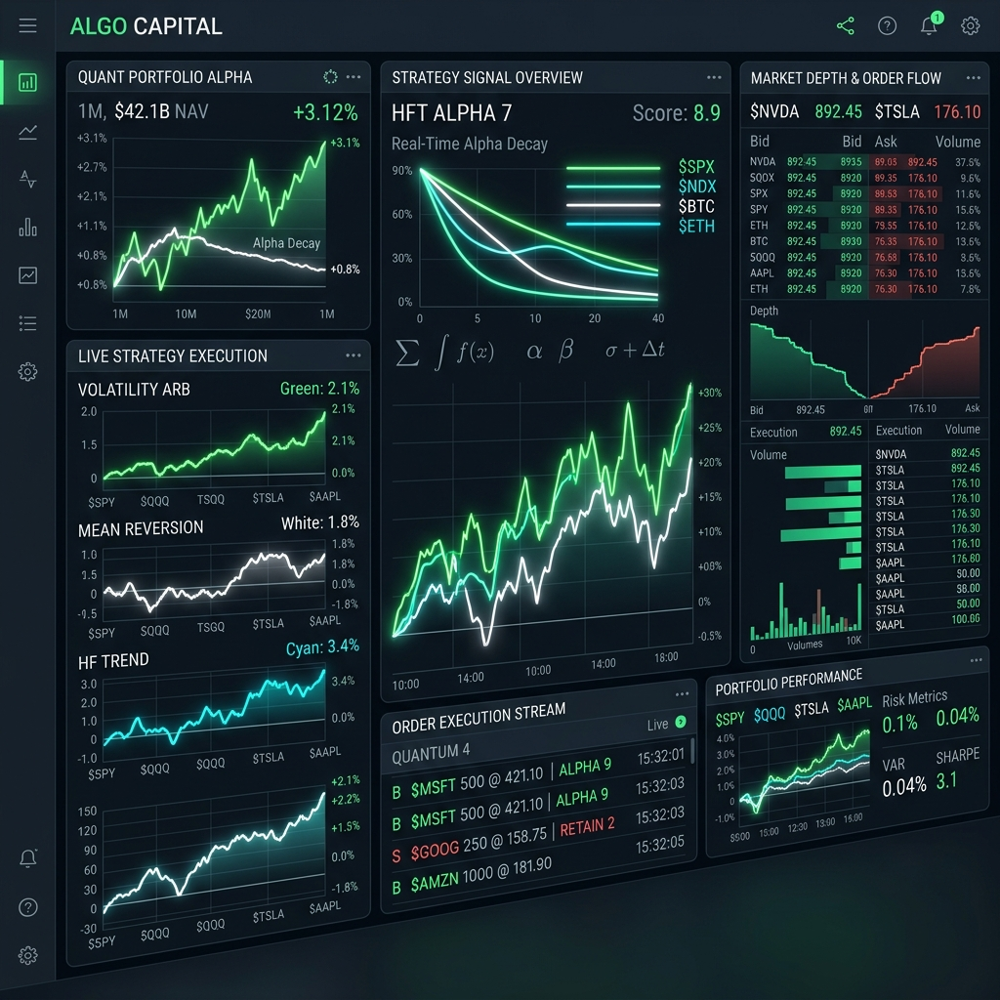
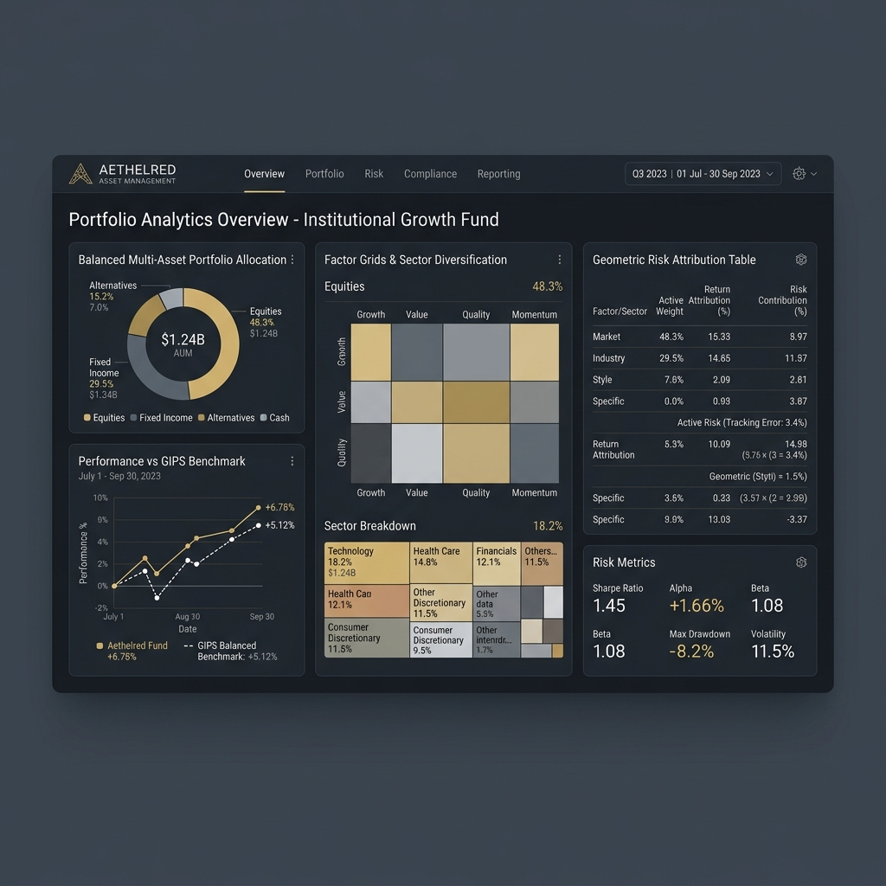
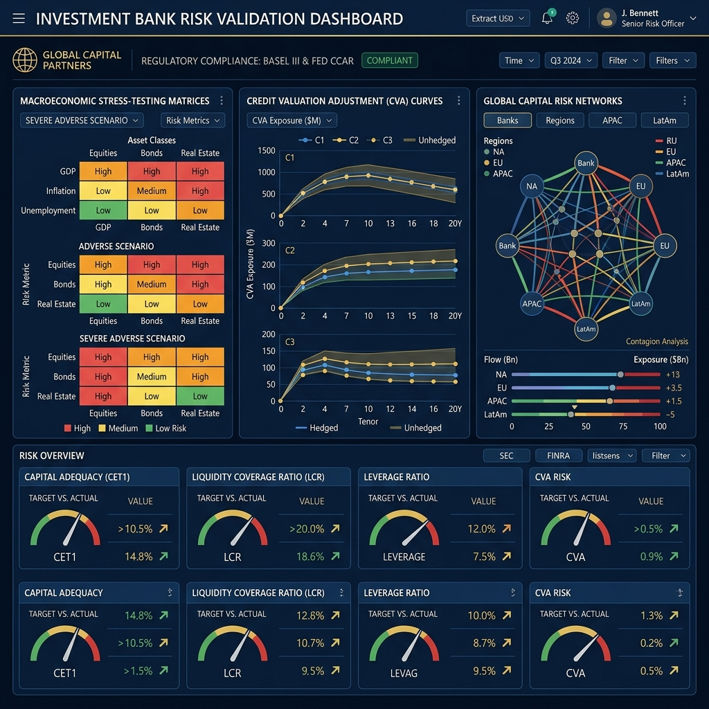

# AI-Assisted Framework for Quantitative Research Governance and Model Validation

[](https://opensource.org/licenses/MIT)
[](https://www.federalreserve.gov/supervisionreg/srletters/sr1107.htm)
[](https://www.sec.gov/rules/final/2010/34-63241.pdf)

---

### **Author: Rignesh P**  
*Quantitative Systems Architect*

---

**This AI-assisted framework is an institutional workflow system for quantitative research governance, backtest validation, portfolio-risk review, execution-quality analysis, and model-risk oversight.** 

Inspired by the operational structures of elite hedge funds, investment banks, market makers, and asset managers, the project provides specialized, role-based workflows for validating and governing systematic trading research. It establishes an **institutional operating framework (System Layer)** that structures multi-agent validation, enforces strict *Review Escalation* rules, and defines standardized *Severity Levels* and *Institutional Approval States*.

---

## Why This Framework Exists: The Governance Wedge

Traditional AI coding assistants focus on **strategy generation** (writing more backtests, fitting more parameters, scraping more data). **This framework focuses on the high-value institutional bottlenecks:**
*   **Preventing Bad Research & False Alpha** — Exposing target leakage, lookahead bias, and survivorship anomalies before they burn capital.
*   **Accelerating Regulatory Validation**  — Automating model risk documentation in compliance with the Federal Reserve **SR 11-7** and UK PRA **SS 1/23** frameworks.
*   **Standardizing Audit Lineage** — Generating standardized, machine-readable validation reports and findings for risk committees.
*   **Enforcing Microstructure Realism** — Auditing slippage models, short borrow constraints (HTB), and market-access risk gates (**SEC Rule 15c3-5**).

---

## Visualizing the Verticals

### 1. Hedge Fund Dashboard (`skills/hedge-funds/`)
Focuses on high-speed trade execution, real-time alpha signal decay indicators, HFT order streams, volatility arbitrage metrics, and market depth tracking.


---

### 2. Asset Management Matrix (`skills/asset-managers/`)
Focuses on balanced multi-asset portfolio allocations, sector diversification factor grids, geometric risk attribution modeling, and standard GIPS benchmark comparisons.


---

### 3. Investment Bank Risk Validation (`skills/investment-banks/`)
Focuses on CCAR/DFAST severely adverse macroeconomic stress matrices, bilateral Credit Valuation Adjustments (CVA) curves, global capital contagion networks, and Basel III capital adequacy ratios.
## Repository Structure

The framework is decoupled into a core **Institutional Operating Layer (System Layer)**, a **Cross-Cutting Pipeline**, and **Vertical Portfolios**:

```
finstack-skills/
├── framework/                      # The System Layer (Institutional Operating Framework)
│   ├── research-lifecycle.md       # Idea-to-production lifecycle procedures
│   ├── governance-framework.md     # Review roles, segregation of duties, & audit trails
│   ├── validation-standards.md     # Mathematical validation, walk-forward, & UAT benchmarks
│   ├── production-readiness.md     # Standardized PR-Score matrix and boundaries
│   └── institutional-controls.md   # SEC 15c3-5, clearing limits, & kill switches
│
├── skills/
│   ├── core/                       # Cross-Cutting Governance Pipeline
│   │   ├── quant-research-director/ # Economic thesis & validation design
│   │   ├── backtest-auditor/       # Forensic bias & leakage check (PR-Score)
│   │   ├── challenger-model-reviewer/ # SR 11-7 conceptual soundness & benchmarking
│   │   ├── model-risk-officer/     # SR 11-7 model risk validation
│   │   ├── portfolio-risk-manager/ # Sizing, Expected Shortfall, & drawdowns
│   │   ├── stress-testing-officer/ # Historical crisis replay & tail risk shocks
│   │   ├── factor-exposure-reviewer/ # Hidden style factor exposure & drift
│   │   ├── production-readiness-reviewer/ # Telemetry, alert bounds, & rollbacks
│   │   ├── quant-red-team/         # Adversarial stress & hard kill criteria
│   │   └── research-governance-chair/ # Multi-agent review pipeline orchestrator
│   │
│   ├── hedge-funds/                # Vertical: Signal, Execution & Alt-Data
│   │   ├── alpha-decay-monitor/    # Half-life decay curves & AUM capacity
│   │   ├── market-microstructure-analyst/ # Queue priority, Almgren-Chriss, & VPIN
│   │   ├── liquidity-risk-officer/ # TTL, concentration risk, & ADV exit bounds
│   │   ├── alpha-decay-reviewer/   # Fama-French idiosyncratic residual alpha
│   │   ├── execution-optimizer/    # TCM, spread crossing, & SPAN margins
│   │   └── alternative-data-auditor/ # Point-in-time integrity & MNPI compliance
│   │
│   ├── asset-managers/             # Vertical: Purity, Mandates & Benchmarks
│   │   ├── portfolio-allocation-committee/ # Risk Parity & Kelly growth allocation sizing
│   │   ├── factor-decomposer/      # Fama-French systematic style drift
│   │   ├── benchmark-tracking-auditor/ # Active Share & UCITS 5/10/40 limits
│   │   └── esg-mandate-reviewer/   # Carbon WACI Scope 1/2 & exclusions
│   │
│   └── investment-banks/           # Vertical: Macro Stress & Clearing Risk
│       ├── ccar-stress-tester/     # CCAR/DFAST macro stress shock replays
│       ├── counterparty-risk-officer/ # Peak Exposure, Wrong-Way Risk, & CVA
│       ├── algorithmic-trading-validator/ # SEC Rule 15c3-5 pre-trade bounds
│       └── regulatory-controls-reviewer/ # MiFID II RTS 6 & FINRA CAT reporting
│
├── docs/
│   ├── assets/                     # Visual assets & vertical dashboards
│   ├── workflow-diagrams/          # Mermaid visualizations of the Quant Lifecycle
│   └── skill-map.md                # Full skill-to-role responsibility matrix
│
├── examples/                       # Real Institutional Example Artifacts (JSON/YAML/CSV)
│   ├── backtest_audit/             # Strategy report, audit output, & findings.json
│   ├── model_risk/                 # YAML model cards & validation reports
│   └── portfolio_review/           # Real CSV positions & stressed ES reports
│
└── README.md
```


---

## The System Layer: Standardized PR-Score

This framework evaluates systematic models using a unified, institutional scoring system. Each validation agent grades the model on a scale of `[0-100]`, generating a composite **PR-Score**:

$$\text{PR-Score} = \text{Data Integrity} \times 0.20 + \text{Validation Quality} \times 0.20 + \text{Risk Controls} \times 0.20 + \text{Execution Assumptions} \times 0.20 + \text{Governance Evidence} \times 0.20$$

*   **PR-Score >= 80:** Approved for production capital allocation.
*   **PR-Score 60-79:** Approved with conditional limits (remediation required).
*   **PR-Score < 60:** Model Rejected. Do Not Deploy.

---

## Quick Start

1. Clone `finstack-skills` into your AI agent's local skills directory (e.g., `~/.claude/skills/finstack-skills` or vendor it directly).
2. Point your AI agent to the workspace and invoke the **Core Governance Pipeline**:
   ```bash
   /quant-research-director     # Evaluate the economic thesis & OOS validation design
   /backtest-auditor            # Run forensic checks for lookahead & survivorship bias
   /challenger-model-reviewer   # Challenge baseline architectures under SR 11-7
   /model-risk-officer          # Conduct regulatory SR 11-7 independent validation
   /portfolio-risk-manager      # Model tail risk, Expected Shortfall, and ADV sizing
   /stress-testing-officer      # Replay historical crisis shocks (2008, COVID, etc.)
   /factor-exposure-reviewer    # Audit unintended factor drift and crowded exposures
   /production-readiness-reviewer # Operational telemetry checks, rollbacks, and PR-Score
   /quant-red-team              # Run adversarial attacks and define hard kill criteria
   /research-governance-chair   # Orchestrate final pipeline and issue approval state
   ```
3. Run specialized audits as needed:
   * **Hedge Funds:** `/alpha-decay-monitor`, `/market-microstructure-analyst`, `/liquidity-risk-officer`, `/alpha-decay-reviewer`, `/execution-optimizer`
   * **Asset Managers:** `/portfolio-allocation-committee`, `/factor-decomposer`, `/benchmark-tracking-auditor`
   * **Investment Banks:** `/ccar-stress-tester`, `/regulatory-controls-reviewer`, `/algorithmic-trading-validator`

### Specialized Skill Dashboards

#### Hedge Fund Signal & Execution Dashboard
*Linked to: `/market-microstructure-analyst`, `/liquidity-risk-officer`, `/alpha-decay-reviewer`*


#### Asset Management Allocation & Factor Matrix
*Linked to: `/portfolio-allocation-committee`, `/factor-decomposer`*


#### Investment Bank Risk & Regulatory Validation
*Linked to: `/regulatory-controls-reviewer`, `/ccar-stress-tester`*


---


## Credits

Inspired by [garrytan/gstack](https://github.com/garrytan/gstack). This framework takes the concept of multi-agent role-playing and scaling loops and applies it directly to the rigorous world of quantitative finance, model governance, and capital risk management.

---

## License

MIT