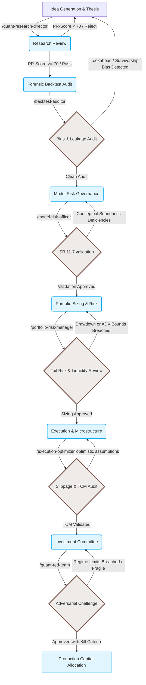

# Quantitative Research Lifecycle & Governance Workflow

This document visualizes the institutional validation workflow implemented by **FinStack**. In elite financial institutions, no strategy is allowed to trade until it successfully runs this linear gauntlet.

---

## Workflow Diagram

---

## Detailed Phase Breakdown

### 1. Research Thesis Evaluation (`/quant-research-director`)
- **Objective:** Interrogate the economic foundation.
- **Goal:** Ensure the model is exploiting a structural market anomaly, not overfitting historical noise.
- **Key Metric:** Economic intuition score.

### 2. Forensic Backtest Audit (`/backtest-auditor`)
- **Objective:** Search for data-snooping, lookahead bias, and constituent survivorship anomalies.
- **Goal:** Eliminate the mathematical lies that make backtests look perfect in simulation.
- **Key Metric:** Deflated Sharpe Ratio (DSR) & Haircut Sharpe.

### 3. Model Governance Validation (`/model-risk-officer`)
- **Objective:** Independent review complying with the Federal Reserve **SR 11-7** framework.
- **Goal:** Establish mathematical boundaries, identify data dependencies, and set drift limits.
- **Key Metric:** SR 11-7 compliance scorecard.

### 4. Portfolio Sizing & Tail Risk (`/portfolio-risk-manager`)
- **Objective:** Size positions based on liquidity limits and extreme tail behavior.
- **Goal:** Prevent single-strategy models from introducing systemic liquidity freezes.
- **Key Metric:** 99% Expected Shortfall (ES) & 10% ADV Time-to-Liquidate bounds.

### 5. Execution Optimization (`/execution-optimizer`)
- **Objective:** Apply non-linear market impact models (Almgren-Chriss) and locate/borrow parameters.
- **Goal:** Ensure gross alpha is not entirely consumed by spread-crossing or borrow fees.
- **Key Metric:** Stressed transaction cost model (TCM) haircut.

### 6. Adversarial Red-Teaming (`/quant-red-team`)
- **Objective:** Actively stress-test the model for factor crowding and structural regime failure.
- **Goal:** Define strict, quantitative **kill criteria** for deactivating the model in production.
- **Key Metric:** Maximum drawdown limit & Signal-to-P&L divergence thresholds.
